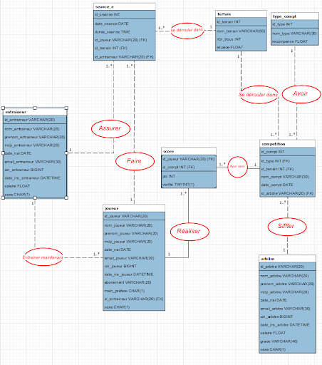
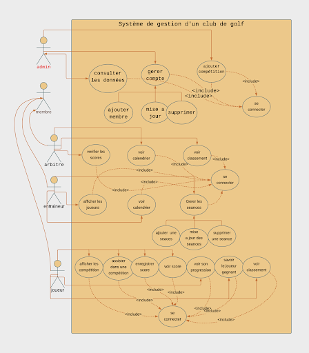

# JAVAGOLF

C'estv un projet academique pour pratiquer l'ingénieurie d'une base de données MySQL et Java Swing GUI .


<h2>Prérquis </h2>
Un serveur MySQl <br>
Java 17 <br>
<h2> Comment Exécuter</h2>

Il faut au début exécuter le script sql pour la création du schéma de notre Base de données et puis lancer l'application par cette commande :
```
mvn -f GOLF1/pom.xml compile exec:java -Dexec.mainClass="com.mycompany.golf1.GOLF1"
```


<h2> Description de l'application </h2>
Cette application permet de gérer les différentes activités au sein d'un club de golf.

Elle est utilisée par soit un admin ou un entraîneur, un arbitre ou un joueur.

Chaque membre autre que l’admin a sa propre interface ou il a des fonctionnalités et des données propres à lui.

D’ailleurs, l’admin n’est pas le seul qui peut modifier, insérer ou supprimer dans la base de données mais tous les autres membres ont des CRUD.

La notion de la date est quasiment fondamentale dans notre système.

Tous les utilisateurs au début doivent s’identifier grâce à un identifiant et un mot de passe. Tous les membres ont la même interface de login qui redirectionne le membre a sa propre interface.

Cette application permet à l’admin de :

-   Ajouter un membre (joueur/arbitre/entraîneur).
    
-   Supprimer un membre (joueur/arbitre/entraîneur).
    
-   Modifier ou attribuer un entraîneur à un joueur ou Modifier le type d’abonnement (lors du renouvellement par exemple) d’un joueur.
    
-   Modifier le salaire d’un entraîneur.
    
-   Modifier le salaire et la grade d'arbitre.
    
-   Ajouter une compétition à une date précise et de type précis (pro, amateur, senior...) et lui attribuer un arbitre
    

Cette application permet à l’arbitre de :

-   Vérifier son calendrier et ses prochaines compétitions.
    
-   En cas d’avoir une compétition aujourd’hui :
    

-   Il doit vérifier les scores introduits par les joueurs. Il peut soit valider le score ou il peut refuser le score, ainsi le joueur doit réintroduire un nouveau score.
    
-   Il peut voir le classement actuel.
    

Cette application permet à l'entraîneur de :

-   Vérifier son calendrier et ses prochaines séances.
    
-   Afficher ses joueurs actuels et ses anciens joueurs
    
-   Ajouter une séance d'entraînement
    
-   Supprimer une séance.
    
-   Modifier la date d’une séance ou le terrain.
    

Cette application permet au joueur de

-   Afficher les listes des compétitions à jouer.
    
-   Inscrire à une compétition.
    
-   Afficher son score dans une compétition.
    
-   Enregistrer son score qui doit être vérifié par l’arbitre ultérieurement.
    
-   Afficher la progression du joueur.
    
-   Et afficher le joueur gagnant dans une compétition donnée qui se fait par une procédure stockée dans la BD.
    

  

Notons que lorsqu’on ajoute un terrain à une compétition ou à une séance d'entraînement, on doit vérifier la disponibilité du terrain, la disponibilité de la date pour l’arbitre pour une compétition et pour l'entraîneur pour un entraîneur.

D’ailleurs, Un entraineur n'entraîne pas qu’une seule séance par jour.

Le jour d’une compétition, les joueurs ne font pas de séance d'entraînement et le terrain n’est pas utilisé ce jour-là.

Le terrain n’est pas disponible aussi si Ilya une séance d’entrainement ce jour-là.

<h2> diagramme de classe </h2>

<h2> diagramme de cas d'utilisation </h2>

